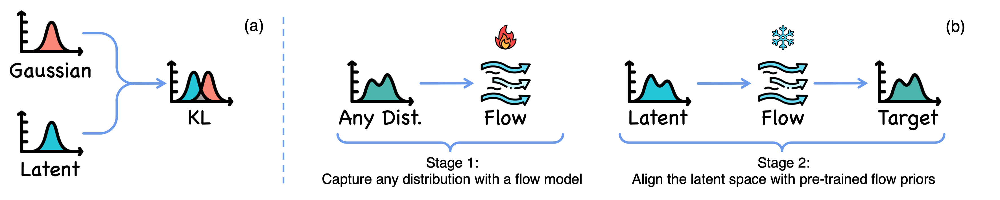

<div align="center"> 

# Aligning Latent Spaces with Flow Priors

[](https://liyizhuo.com/align/)
[](https://arxiv.org/abs/2506.05240)

</div>

This repository contains the implementation for paper Aligning Latent Spaces with Flow Priors.

> This paper presents a novel framework for aligning learnable latent spaces to arbitrary target distributions by leveraging flow-based generative models as priors. Our method first pretrains a flow model on the target features to capture the underlying distribution. This fixed flow model subsequently regularizes the latent space via an alignment loss, which reformulates the flow matching objective to treat the latents as optimization targets. We formally prove that minimizing this alignment loss establishes a computationally tractable surrogate objective for maximizing a variational lower bound on the log-likelihood of latents under the target distribution. Notably, the proposed method eliminates computationally expensive likelihood evaluations and avoids ODE solving during optimization. As a proof of concept, we demonstrate in a controlled setting that the alignment loss landscape closely approximates the negative log-likelihood of the target distribution. We further validate the effectiveness of our approach through large-scale image generation experiments on ImageNet with diverse target distributions, accompanied by detailed discussions and ablation studies. With both theoretical and empirical validation, our framework paves a new way for latent space alignment.


*(a) Conventional alignment works with only known priors (e.g., Gaussian or categorical) using KL or cross-entropy losses. (b) Our proposed method can align the latent distribution to **arbitrary** target distribution captured by a pre-trained flow model.*

## Table of Contents

- [Project Structure](#project-structure)
- [Installation](#installation)
- [Toy Examples](#toy-examples)
- [Autoencoder Training](#autoencoder-training)
- [MAR Training](#mar-training)

## Project Structure

```
├── README.md                          # This file
├── continuous_tokenizer/              # Autoencoder implementation
│   ├── requirements.txt               # Python dependencies
│   ├── toy_examples/                  # 2D demonstration scripts
│   │   ├── flow_train_then_guide.py   # Main toy training script
│   │   └── visualize.py               # Visualization utilities
│   ├── scripts/                       # Training automation scripts
│   │   ├── train_flowhead/            # Flow head training scripts
│   │   │   └── flowhead-qwen-0.5B-proj.sh
│   │   └── train/                     # Full autoencoder training
│   │       └── flowae-qwen-proj-head-w-1e2-l-64-50ep.sh
│   └── src/                           # Source code (model implementations)
└── mar/                               # MAR model implementation
    ├── requirements.txt               # MAR-specific dependencies
    ├── estimate_vae_scaling.py        # Scaling factor computation
    └── scripts/                       # MAR training scripts
        ├── cache/                     # Latent caching scripts
        │   └── flowae_qwen_proj_head_w_1e2.sh
        └── imagenet/                  # MAR training scripts
            └── flowae_qwen_proj_head_w_1e2.sh
```

## Installation

### Basic Requirements

```bash
# Clone the repository
git clone https://github.com/liyz15/Aligning-Latent-Spaces-with-Flow-Priors.git
cd align_code

# Install autoencoder dependencies
pip install -r continuous_tokenizer/requirements.txt

# Install MAR dependencies (if using MAR component)
pip install -r mar/requirements.txt
```

### Additional Setup for MAR

The MAR component requires additional files from the original repository, note that MAR uses a modified version of torch_fidelity for faster FID evaluation which is not compatible with the continuous_tokenizer version, make sure you are using the correct version when running continuous_tokenizer or MAR:

```bash
# Download missing components from the original MAR repository
# https://github.com/LTH14/mar
# 
# Required files (removed due to size constraints):
# - src/torch_fidelity/
# - fid_stats/
```

## Toy Examples

### Purpose

The toy examples demonstrate the core concept of flow-based latent space alignment using simple 2D synthetic distributions. These examples help visualize how normalizing flows can transform complex distributions into simpler, more structured representations.

### Supported Distributions

| Distribution | Description |
|--------------|-------------|
| **Mixture of Gaussians** | Multiple Gaussian components arranged in a circle |
| **Grid of Gaussians** | Gaussian mixture arranged in a regular grid |
| **Spiral** | Spiral-shaped continuous distribution |
| **Moons** | Two interleaving half-moon shapes | Classification boundaries |
| **Concentric Rings** | Nested circular distributions | Hierarchical structure modeling |
| **Swiss Roll** | 3D manifold embedded in 2D space | Dimensionality reduction |

### Running Toy Examples

```bash
# Basic training with default parameters
python continuous_tokenizer/toy_examples/flow_train_then_guide.py --distribution <distribution_name>

# Generate visualizations
python continuous_tokenizer/toy_examples/visualize.py
```

## Autoencoder Training

### Overview

The autoencoder component trains a flow-augmented autoencoder that learns to encode data into a latent space with structured priors. The training happens in two stages:

1. **Flow Head Training**: Trains the flow-based component that enforces structured priors
2. **Complete Autoencoder Training**: Trains the full autoencoder with the pre-trained flow head

### Stage 1: Flow Head Training

The flow head is responsible for transforming the encoder output into a structured latent space, first you should extract the text embeddings from the Qwen2.5-0.5B model and save them to `/path/to/Qwen2.5-0.5B-embed_tokens.pt`, then run:

```bash
bash continuous_tokenizer/scripts/train_flowhead/flowhead-qwen-0.5B-proj.sh
```

### Stage 2: Autoencoder Training

After the flow head is trained, train the complete autoencoder:

```bash
bash continuous_tokenizer/scripts/train/flowae-qwen-proj-head-w-1e2-l-64-50ep.sh
```

## MAR Training

### Overview

The MAR (Masked Autoregressive) component trains generative models that operate on the structured latent representations produced by the autoencoder. This enables high-quality generation in the learned latent space.

### Stage 1: Cache Latent Representations

Pre-compute and cache the latent representations from your trained autoencoder for faster training:

```bash
bash mar/scripts/cache/flowae_qwen_proj_head_w_1e2.sh
```

### Stage 2: Estimate VAE Scaling Factor

Compute normalization parameters for stable MAR training:

```bash
# Estimate scaling factor for cached latents
python mar/estimate_vae_scaling.py path/to/cached/latents --num_samples 10000
```

**Parameters:**
- `path/to/cached/latents`: Path to the cached latent files from Stage 1
- `--num_samples`: Number of samples to use for estimation (more = more accurate)

### Stage 3: Train MAR Model

After modifying the scaling factor, train the MAR model on the cached and normalized latents:

```bash
# Train MAR on the structured latents
bash mar/scripts/imagenet/flowae_qwen_proj_head_w_1e2.sh
```

## Citation

If you find this work helpful, please consider citing:

```
@misc{li2025aligning,
  title={Aligning Latent Spaces with Flow Priors},
  author={Li, Yizhuo and Ge, Yuying and Ge, Yixiao and Shan, Ying and Luo, Ping},
  year={2025},
  url={https://arxiv.org/abs/2506.05240}
}
```

## Acknowledgement


This project builds upon the work of many outstanding prior research efforts including:

- [SoftVQ](https://github.com/Hhhhhhao/continuous_tokenizer)
- [MAR](https://github.com/LTH14/mar)

Thanks for their great work!
